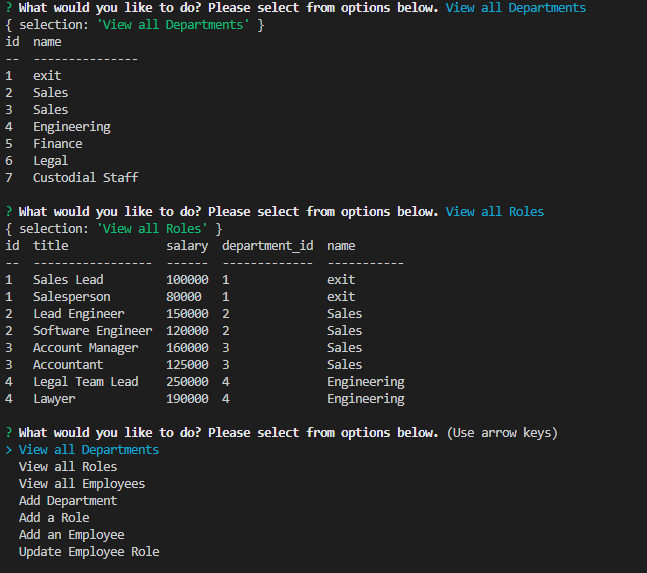

## Employee Tracker

  
  
 
  ## Table of Contents
  - [Description](#description)
  - [Installation](#nstallation)
  - [Contributors](#contributors)
  - [Usage](#usage)
  - [Tests](#tests)
  - [Questions](#questions)

  ## Description
  Create a databases that will allow to add and update several fields. Thew user will be able to view all departments, employees, and roles. They will be able to add new departments, roles and employees. They will be able to choose from current employees and update their role if needed.

  ## License
        This license was used for this application
  
  

  ## Installation
  npm i for all dependcies 
  ## Contributors
  Email me if you would like to contribute
  ## Usage
  To help employers track and edit employees. The application will give the employer a better tracking system that will be user friendly and easy to navigate.
  ## Tests
  None 
  ## Questions
  - GitHub Repo: https://github.com/RafaelH731/employee-tracker
  - Email: rafaelherrera731@gmail.com
  - Video: Youtube link will go here

  ## Screenshots
  - 
  - 

